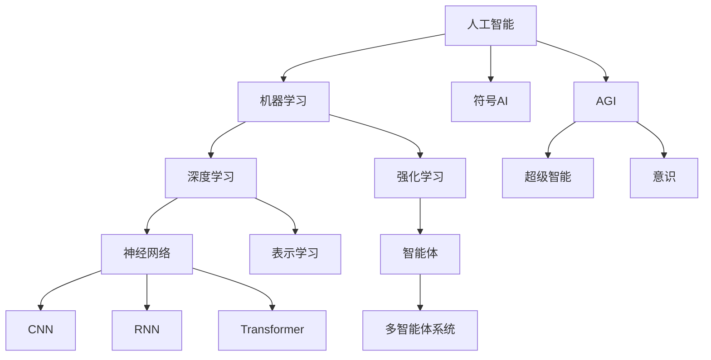

# AI前沿知识书籍总结与分析

## 概述

本文档总结了AI前沿领域的核心书籍，涵盖AGI、智能体、上下文理解、深度学习等关键领域，为构建完整的AI知识体系提供理论基础。

## 📚 核心书籍分类与总结

### 🤖 AGI（通用人工智能）理论基础

#### 1. 《超级智能》（Superintelligence）- Nick Bostrom
**核心观点：**
- AGI发展的三种路径：全脑仿真、生物认知增强、机器智能
- 智能爆炸理论：递归自我改进导致的指数级智能增长
- 控制问题：如何确保超级智能与人类价值观对齐
- 存在风险：AGI可能带来的生存威胁

**关键概念：**
- 智能爆炸（Intelligence Explosion）
- 价值对齐问题（Value Alignment Problem）
- 正交性论题（Orthogonality Thesis）
- 工具性收敛（Instrumental Convergence）

#### 2. 《生命3.0》（Life 3.0）- Max Tegmark
**核心观点：**
- 生命进化的三个阶段：生命1.0（硬件和软件都进化）、生命2.0（硬件进化，软件学习）、生命3.0（硬件和软件都可设计）
- AI对宇宙未来的深远影响
- 意识的物理基础和信息整合理论
- 多元宇宙中智能的可能形态

**关键概念：**
- 信息整合理论（Integrated Information Theory）
- 宇宙觉醒（Cosmic Awakening）
- 智能的基质独立性（Substrate Independence）

#### 3. 《人工智能：一种现代方法》（第4版）- Stuart Russell & Peter Norvig
**核心观点：**
- 理性智能体的概念框架
- 搜索、推理、学习、感知的统一理论
- 机器学习与符号AI的融合
- 不确定性下的决策理论

**关键概念：**
- 理性智能体（Rational Agent）
- 搜索空间（Search Space）
- 贝叶斯网络（Bayesian Networks）
- 马尔可夫决策过程（MDP）

### 🤖 智能体系统理论

#### 4. 《多智能体系统》（Multiagent Systems）- Gerhard Weiss
**核心观点：**
- 分布式人工智能的理论基础
- 智能体间的协作、竞争和学习机制
- 涌现行为和集体智能
- 博弈论在多智能体系统中的应用

**关键概念：**
- 涌现行为（Emergent Behavior）
- 协调机制（Coordination Mechanisms）
- 拍卖算法（Auction Algorithms）
- 联盟形成（Coalition Formation）

#### 5. 《强化学习：原理与Python实现》- 肖智清
**核心观点：**
- 马尔可夫决策过程的数学基础
- 价值函数和策略优化
- 深度强化学习的算法原理
- 多智能体强化学习

**关键概念：**
- Q学习（Q-Learning）
- 策略梯度（Policy Gradient）
- Actor-Critic算法
- 经验回放（Experience Replay）

### 🧠 认知与上下文理解

#### 6. 《深度学习》- Ian Goodfellow, Yoshua Bengio, Aaron Courville
**核心观点：**
- 深度神经网络的数学基础
- 反向传播和梯度优化
- 卷积网络、循环网络、注意力机制
- 生成模型和表示学习

**关键概念：**
- 反向传播（Backpropagation）
- 注意力机制（Attention Mechanism）
- 变分自编码器（VAE）
- 生成对抗网络（GAN）

#### 7. 《注意力机制与Transformer》相关研究
**核心观点：**
- "Attention Is All You Need"的突破性贡献
- 自注意力机制的数学原理
- 位置编码和多头注意力
- 预训练语言模型的发展

**关键概念：**
- 自注意力（Self-Attention）
- 多头注意力（Multi-Head Attention）
- 位置编码（Positional Encoding）
- 掩码机制（Masking）

#### 8. 《认知科学导论》- 李恒威
**核心观点：**
- 人类认知的计算理论
- 记忆、注意力、语言理解的机制
- 认知架构和符号处理
- 具身认知和环境交互

**关键概念：**
- 认知架构（Cognitive Architecture）
- 工作记忆（Working Memory）
- 具身认知（Embodied Cognition）
- 心理表征（Mental Representation）

### 🚀 前沿技术与应用

#### 9. 《大模型时代》- 张俊林
**核心观点：**
- 大语言模型的发展历程
- Transformer架构的演进
- 预训练-微调范式
- 涌现能力和规模定律

**关键概念：**
- 涌现能力（Emergent Abilities）
- 规模定律（Scaling Laws）
- 上下文学习（In-Context Learning）
- 思维链推理（Chain-of-Thought）

#### 10. 《机器学习年鉴》（持续更新）
**核心观点：**
- 最新算法和技术突破
- 理论进展和实践应用
- 跨学科融合趋势
- 开放问题和未来方向

### 📖 补充重要书籍

#### 11. 《模式识别与机器学习》- Christopher Bishop
**核心观点：**
- 贝叶斯方法在机器学习中的应用
- 概率图模型和变分推理
- 核方法和支持向量机
- 神经网络的概率解释

#### 12. 《统计学习理论》- Vladimir Vapnik
**核心观点：**
- VC维理论和泛化界
- 结构风险最小化原理
- 支持向量机的理论基础
- 学习理论的数学框架

#### 13. 《信息论、推理与学习算法》- David MacKay
**核心观点：**
- 信息论与机器学习的深层联系
- 熵、互信息和编码理论
- 贝叶斯推理和MCMC方法
- 纠错码和通信理论

#### 14. 《计算机视觉：算法与应用》- Richard Szeliski
**核心观点：**
- 图像处理和特征提取
- 立体视觉和运动估计
- 目标识别和场景理解
- 深度学习在视觉中的应用

#### 15. 《自然语言处理综论》- Daniel Jurafsky & James Martin
**核心观点：**
- 语言学基础和计算模型
- 词法、句法、语义分析
- 机器翻译和对话系统
- 神经语言模型

## 🔗 知识体系的内在联系

### 理论层次结构
```
哲学层面：意识、智能本质、价值对齐
    ↓
数学层面：信息论、概率论、优化理论
    ↓
算法层面：搜索、学习、推理算法
    ↓
系统层面：智能体架构、多智能体系统
    ↓
应用层面：视觉、语言、决策系统
```

### 核心概念网络
- **智能**：从符号AI到连接主义，从专用到通用
- **学习**：从监督学习到强化学习，从单智能体到多智能体
- **表示**：从符号表示到分布式表示，从静态到动态
- **推理**：从逻辑推理到概率推理，从精确到近似
- **交互**：从人机交互到智能体交互，从单模态到多模态

### 发展趋势分析
1. **统一理论**：寻求统一的智能理论框架
2. **多模态融合**：视觉、语言、行动的统一建模
3. **因果推理**：从相关性到因果性的跨越
4. **可解释性**：黑盒模型的透明化
5. **安全对齐**：确保AI系统的安全可控

## 📊 知识图谱构建

### 核心概念关系图


### 技术演进时间线
- **1950s-1960s**：符号AI、专家系统
- **1980s-1990s**：神经网络复兴、机器学习
- **2000s-2010s**：深度学习突破、大数据
- **2010s-2020s**：注意力机制、Transformer、大模型
- **2020s-未来**：AGI、多模态、具身智能

## 🎯 学习路径建议

### 基础路径（6个月）
1. 数学基础：线性代数、概率论、优化理论
2. 机器学习：监督学习、无监督学习、评估方法
3. 深度学习：神经网络、反向传播、常见架构
4. 编程实践：Python、TensorFlow/PyTorch

### 进阶路径（6个月）
1. 强化学习：MDP、Q学习、策略梯度
2. 自然语言处理：词向量、序列模型、Transformer
3. 计算机视觉：CNN、目标检测、图像生成
4. 多智能体系统：协作学习、博弈论

### 高级路径（持续）
1. AGI理论：意识、通用智能、价值对齐
2. 前沿技术：大模型、多模态、因果推理
3. 研究方法：论文阅读、实验设计、学术写作
4. 产业应用：系统设计、工程实践、伦理考量

## 📝 总结

这些书籍构成了AI前沿知识的完整体系，从理论基础到实践应用，从单一技术到系统集成，为深入理解和掌握AI技术提供了全面的知识框架。通过系统学习这些内容，可以建立起对AI领域的全局认知，为进一步的研究和应用奠定坚实基础。